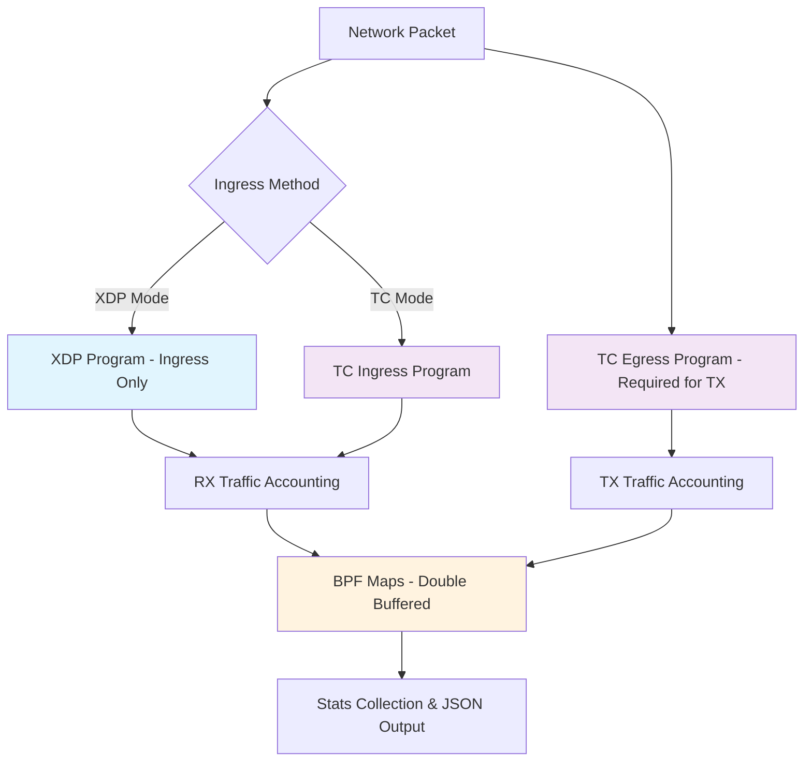
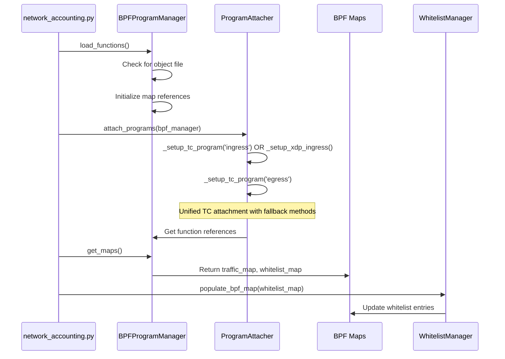
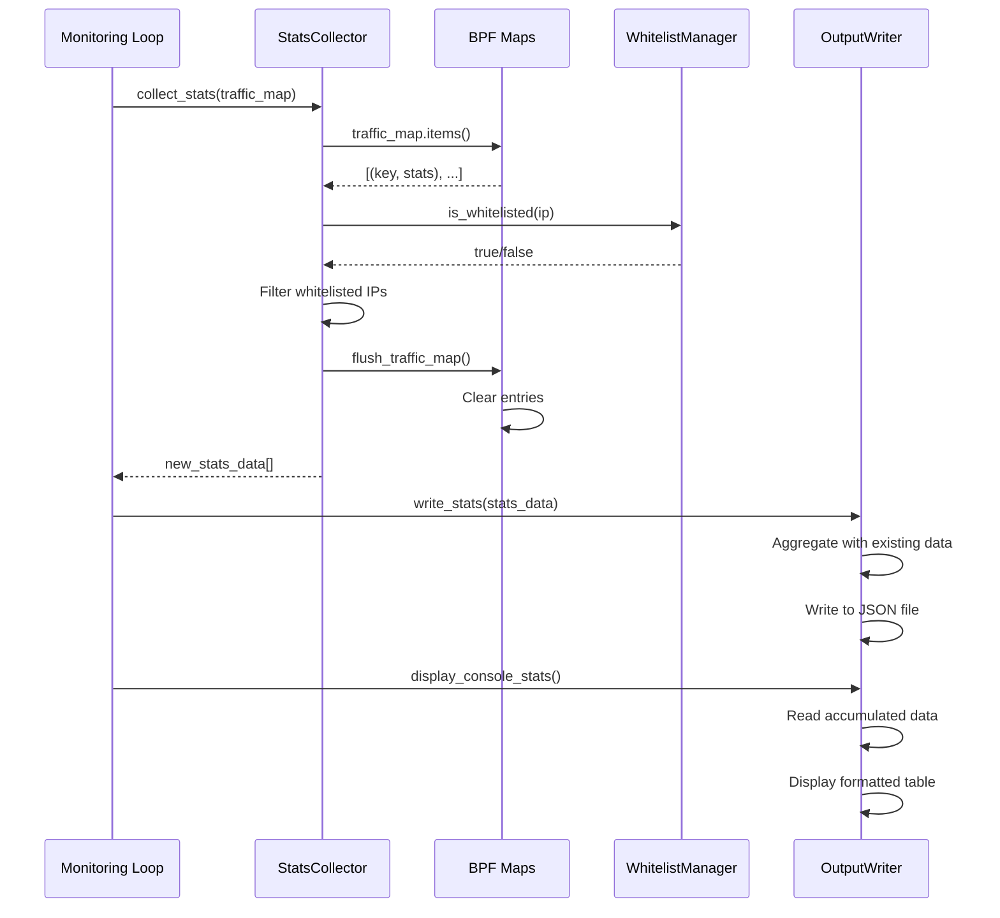

# Network Accounting eBPF Module - Production Ready

A high-performance network traffic accounting system using eBPF with **configurable ingress methods** (XDP/TC), namespace support, whitelist functionality, and JSON output format.

**Optimized for AlmaLinux 9 with kernel 5.14.0-427.33.1.el9_4.x86_64**

## 🚀 Quick Start

```bash
# 1. Install dependencies
sudo ./check_and_install.sh

# ensure that system has internet and the repo is default (if not copy the alma repo to the etc/yum.repos.d path)
# 2. Build eBPF programs  
make all

# 3. Run single interface monitoring
sudo python3 -m useracct/network_accounting eth0

# 4. Run multi-instance monitoring
sudo python3 -m useracct/multi_network_accounting.py config/multi_accounting_config.json

# 5. Cleanup when done
make cleanup

# 6. If issues occur, see debugging guide below
```

## 🔀 XDP vs TC Flow Architecture

### **XDP vs TC Limitations & Capabilities**

**XDP (eXpress Data Path):**
- ✅ **Ingress Only**: XDP programs attach only at the network driver level for incoming packets
- ✅ **Highest Performance**: ~50ns latency, 10+ Gbps throughput, <0.5% CPU usage  
- ⚠️ **Namespace Limitations**: Limited support for network namespace monitoring
- ⚠️ **No Egress Support**: Cannot monitor outbound traffic (TX)

**TC (Traffic Control):**
- ✅ **Bidirectional**: Supports both ingress and egress traffic monitoring
- ✅ **Full Namespace Support**: Works seamlessly with container/namespace isolation
- ✅ **Egress Capability**: Only method available for outbound (TX) traffic accounting
- ⚠️ **Lower Performance**: ~100ns latency, 5+ Gbps throughput, <1% CPU usage

### **System Flow Architecture**



### **Implementation Flow in Code**

**program_attacher.py:35-98** orchestrates the dual-path flow:

1. **Ingress Path Selection** (lines 49-53):
```python
if self.use_tc_ingress:
    ingress_success = self._setup_tc_program(bpf_manager, 'ingress')
else:
    ingress_success = self._setup_xdp_ingress(bpf_manager)  # Default
```

2. **Egress Always TC** (lines 55-58):
```python
# Attach egress program (always TC - XDP cannot handle egress)
egress_success = self._setup_tc_program(bpf_manager, 'egress')
```

### **eBPF Program Mapping**

**network_accounting.bpf.c** contains multiple program sections:

| Program Section | Direction | Method | Lines | Purpose |
|-----------------|-----------|--------|-------|---------|
| `SEC("xdp")` | Ingress | XDP | 302-337 | High-performance RX accounting |
| `SEC("classifier/ingress")` | Ingress | TC | 373-408 | TC-based RX accounting |  
| `SEC("classifier/egress")` | Egress | TC | 444-478 | TX accounting (only option) |

### **Performance vs Compatibility Matrix**

| Scenario | Recommended Method | Ingress | Egress | Performance | Namespace Support |
|----------|-------------------|---------|--------|-------------|-------------------|
| **High-throughput host** | XDP + TC | XDP | TC | Maximum | Limited |
| **Container monitoring** | TC + TC | TC | TC | High | Excellent |
| **Namespace isolation** | TC + TC | TC | TC | High | Full |
| **Legacy systems** | TC + TC | TC | TC | Good | Good |

### **Usage Examples**

```bash
# XDP ingress + TC egress (highest performance)
sudo python3 -m useracct.network_accounting --xdp eth0

# TC ingress + TC egress (best compatibility)  
sudo python3 -m useracct.network_accounting eth0

# Namespace monitoring (TC required)
sudo python3 -m useracct.network_accounting --namespace mynamespace eth0
```

### **Key Architectural Insights**

1. **XDP Limitation**: Cannot monitor egress traffic - this is a fundamental kernel limitation
2. **Dual System**: All deployments use TC for egress, choice only affects ingress path
3. **Namespace Reality**: XDP attachment in namespaces requires manual setup (fixed in bpf_manager.py)
4. **Performance Trade-off**: XDP provides ~2x better performance but TC offers better flexibility  
5. **Production Pattern**: Both XDP and TC now use pre-compiled objects for optimal performance
6. **Fix Applied**: XDP mode no longer falls back to BCC - uses pre-compiled objects like TC mode

## 🔧 Recent Improvements (2025)

### **XDP Pre-compiled Object Fix**

**Issue Fixed**: XDP mode was incorrectly falling back to BCC dynamic compilation instead of using pre-compiled objects.

**Before (Broken):**
```
XDP mode: Loading with BCC                 ← Wrong path
❌ Could not load object file
❌ Failed to initialize BPF
```

**After (Fixed):**
```
XDP mode: Using pre-compiled object file   ← Correct path
✓ Found object file: build/objects/network_accounting_eth0.bpf.o  
✓ XDP program attached via object file to eth0
✓ Found all required separate RX/TX control maps
```

**Files Changed:**
- `useracct/bpf_manager.py` - Fixed loading logic for both XDP and TC
- `useracct/program_attacher.py` - Added pre-compiled XDP attachment support

**Impact**: Both XDP and TC modes now use production-ready pre-compiled objects, eliminating BCC dependency and improving performance.

### **Map Pattern Matching Improvements**

**Issue Fixed**: Tagged maps (e.g., `t_m_a_r_eth0`) were not being found due to rigid pattern matching.

**Improvements Made:**
- **Flexible tag detection**: Supports both constructor tags and filename-based tags
- **Enhanced debugging**: Shows available vs expected maps in debug mode  
- **Fallback matching**: Handles various tag naming scenarios
- **Better error messages**: Clear indication of missing vs mismatched maps

**Debug Output Example:**
```
🔍 Effective tag for map lookup: 'eth0'
🔍 Available maps in kernel:
   t_m_a_r_eth0 (ID: 123)
   t_m_b_r_eth0 (ID: 124)
✅ Exact match rx_a: t_m_a_r_eth0 (ID: 123)
✅ Exact match rx_b: t_m_b_r_eth0 (ID: 124)
✓ Found all required separate RX/TX control maps
```

> 💡 **Having issues?** Jump to the [🐛 Comprehensive Debugging Guide](#-comprehensive-debugging-guide) for step-by-step troubleshooting.

## 🏗️ Project Structure

```
network_accounting/
├── useracct/                      # Core Python application modules
│   ├── __init__.py                # Package initialization
│   ├── network_accounting.py      # Main entry point & orchestration
│   ├── multi_network_accounting.py # Multi-instance management
│   ├── bpf_manager.py             # eBPF program lifecycle management  
│   ├── program_attacher.py        # Unified program attachment (XDP/TC) handling
│   ├── stats_collector.py         # BPF map data collection & processing
│   ├── output_writer.py           # JSON output formatting
│   ├── whitelist_manager.py       # IP filtering & CIDR support (JSON only)
│   ├── network_interface.py       # Interface validation & namespace ops
│   ├── utils.py                   # Core utilities & helpers
│   ├── cleanup_bpf.py             # eBPF cleanup utility
│   └── test_attach_tc_programs.py # TC program testing utility
├── ebpf/                          # eBPF source code
│   ├── network_accounting.bpf.c   # eBPF kernel programs
│   ├── vmlinux.h                  # Kernel headers
│   ├── convert_bpf.py             # BPF conversion utility
│   └── bpf_program.py             # BPF program utilities
├── config/                        # Configuration files
│   ├── multi_accounting_config.json # Multi-instance configuration
│   ├── whitelist.json             # Default IP whitelist
│   ├── mynamespace_whitelist.json         # MyNamespace-specific whitelist
│   ├── bear-develop_whitelist.json # Bear-develop whitelist
│   └── almalinux.repo             # AlmaLinux repository configuration
├── logs/                          # Output files and logs
│   ├── traffic_stats.json         # Main traffic statistics
│   ├── bd_traffic_stats.json      # BD-specific statistics
│   ├── mynamespace_traffic_stats.json     # MyNamespace-specific statistics
│   ├── traffic.json               # Additional traffic data
│   ├── compile.log                # Compilation logs
│   └── compile_error.log          # Compilation error logs
├── scripts/                       # Setup and utility scripts
│   ├── generate_tagged_objects.py # Object generation utility
│   └── cleanup.py                 # General cleanup script
├── build/                         # Build system artifacts
│   ├── deps/                      # Dependencies
│   └── objects/                   # Compiled eBPF objects
│       ├── network_accounting.bpf.o      # Default compiled object
│       └── network_accounting_*.bpf.o    # Tagged compiled objects
├── check_and_install.sh           # Automated dependency installer
├── fix_kernel_headers.sh          # Kernel headers fix script
├── Makefile                       # Build system with dependency checks
└── README.md                      # This documentation
```

## 🏭 BPF Program Loading Methods

This system supports **two distinct approaches** for loading eBPF programs:

### **Method 1: Pre-Compiled Objects (Production - Default)**
**Used by:** TC mode, main system architecture

**Workflow:**
```bash
# Step 1: Compile eBPF source to object files
make all  # Creates tagged .bpf.o files in build/objects/

# Step 2: Load via kernel TC subsystem (automated by program)
tc filter add dev eth0 ingress bpf obj network_accounting_tag.bpf.o section classifier/ingress
tc filter add dev eth0 egress bpf obj network_accounting_tag.bpf.o section classifier/egress
```

**Advantages:**
- ✅ **Production-ready**: No runtime compilation dependencies
- ✅ **High Performance**: Pre-validated bytecode, faster loading
- ✅ **System Stability**: Kernel manages maps via bpftool
- ✅ **Multi-Instance**: Tagged objects for namespace isolation
- ✅ **Resource Efficient**: No BCC runtime overhead

**Technical Details:**
- **Source:** `ebpf/network_accounting.bpf.c`
- **Build System:** `Makefile` with intelligent tagging
- **Map Access:** Via `bpftool` and kernel map IDs (see `bpf_manager.py:172`)
- **Tagged Objects:** `build/objects/network_accounting_<tag>.bpf.o`
- **Loader:** `useracct/bpf_manager.py` TC mode (lines 82-131)

### **Method 2: Dynamic Compilation (Development - Alternative)**
**Used by:** BCC dynamic loading, development/testing

**Workflow:**
```python
from ebpf.bpf_program import create_dynamic_accounting

# Runtime compilation and loading
accounting = create_dynamic_accounting("eth0", use_xdp=True, debug=True)
accounting.load_program()    # Compiles eBPF source at runtime
accounting.attach_programs() # Attaches via BCC APIs
accounting.start_monitoring()
```

**Advantages:**
- ✅ **Development Friendly**: No pre-compilation needed
- ✅ **Rapid Prototyping**: Immediate code changes
- ✅ **Direct Map Access**: BCC provides Python map objects
- ✅ **Flexible Attachment**: XDP/TC modes easily switchable
- ✅ **Built-in Monitoring**: Simple traffic display included

**Technical Details:**
- **Source:** `ebpf/bpf_program.py` (BCC format)
- **Runtime Compiler:** BCC handles clang compilation
- **Map Access:** Direct BCC table objects (`traffic_map_a_rx.items()`)
- **XDP Support:** `bpf.attach_xdp()`, `bpf.remove_xdp()`
- **Loader:** `ebpf/bpf_program.py:BPFNetworkAccounting` class

### **Comparison Matrix**

| Feature | Pre-Compiled (Method 1) | Dynamic (Method 2) |
|---------|-------------------------|---------------------|
| **Production Use** | ✅ Recommended | ⚠️ Testing/Dev only |
| **Performance** | ✅ Fastest loading | ⚠️ Compilation overhead |
| **Dependencies** | ✅ clang + bpftool | ⚠️ BCC + python-bcc |
| **Multi-Instance** | ✅ Tagged objects | ⚠️ Requires manual handling |
| **Map Management** | ⚠️ Via bpftool JSON | ✅ Direct Python objects |
| **XDP Support** | ✅ Full support | ✅ Full support |
| **Debugging** | ⚠️ Requires recompilation | ✅ Live code changes |
| **Resource Usage** | ✅ Minimal | ⚠️ BCC runtime overhead |

### **When to Use Each Method**

**Use Pre-Compiled (Method 1) for:**
- 🏭 **Production deployments**
- 🔄 **Multi-instance setups**
- ⚡ **Performance-critical applications**
- 🎯 **Namespace-isolated monitoring**
- 🛡️ **Stable, long-running systems**

**Use Dynamic (Method 2) for:**
- 🧪 **Development and testing**
- 🔬 **eBPF program experiments**
- 🚀 **Rapid prototyping**
- 🐛 **Debugging eBPF code**
- 📊 **Simple monitoring tasks**

### **Quick Start Examples**

#### Pre-Compiled Method (Current System):
```bash
# Build and run production system
make all
sudo python3 -m useracct.multi_network_accounting config/multi_accounting_config.json
```

#### Dynamic Method (New Capability):
```bash
# Run dynamic compilation example
sudo python3 ebpf/bpf_program.py eth0 --xdp --debug

# Or use programmatically:
python3 -c "
from ebpf.bpf_program import create_dynamic_accounting
accounting = create_dynamic_accounting('eth0', use_xdp=True, debug=True)
accounting.load_program()
accounting.attach_programs()
accounting.populate_whitelist(['127.0.0.1'])
accounting.start_monitoring(duration=30)
accounting.cleanup()
"
```

## 🔄 Detailed Code Flow Architecture

### Primary Entry Points & Flow Patterns

#### 1. Single Instance Mode (network_accounting.py)

```mermaid
flowchart TD
    A[main()] --> B[parse_arguments()]
    B --> C[check_root_privileges()]
    C --> D[validate_interface()]
    D --> E[create_NetworkAccountingModule()]
    
    E --> F[load_bpf_program()]
    F --> G[BPFProgramManager.load_functions()]
    G --> H[ProgramAttacher.attach_programs()]
    H --> I[get_maps()]
    I --> J[populate_whitelist_map()]
    
    J --> K[run_monitoring()]
    K --> L[monitoring_loop]
    L --> M[StatsCollector.collect_stats()]
    M --> N[OutputWriter.write_stats()]
    N --> O[OutputWriter.display_console()]
    O --> P[sleep(5)]
    P --> L
    
    L --> Q[SIGINT/SIGTERM]
    Q --> R[ProgramAttacher.cleanup()]
    R --> S[exit]
```

#### 2. Multi-Instance Mode (multi_network_accounting.py)

```mermaid
flowchart TD
    A[MultiNetworkAccountingManager.run()] --> B[load_config()]
    B --> C[start_all_instances()]
    C --> D[For each instance]
    D --> E[start_instance() - subprocess]
    E --> F[network_accounting.py process]
    
    F --> G[monitor_instances()]
    G --> H[check_instance_health()]
    H --> I[display_summary()]
    I --> J[read_summary_from_file()]
    J --> K[sleep(5)]
    K --> G
    
    G --> L[SIGINT/stop_all]
    L --> M[terminate all subprocesses]
    M --> N[cleanup_bpf.py]
    N --> O[exit]
```

### Core Module Interaction Flow

#### BPF Program Loading & Attachment (Updated Architecture)



#### Data Collection & Processing Flow



## 🚀 Invocation Methods & Use Cases

The system supports two execution methods:
- **Module execution** (recommended): `python3 -m useracct.network_accounting`
- **Direct execution**: `python3 useracct/network_accounting.py`

Both methods support the same arguments and functionality, but module execution provides better path resolution.

### 1. Basic Single Interface Monitoring

#### XDP Ingress (Highest Performance - optional)
```bash
# Basic monitoring with XDP
sudo python3 -m useracct/network_accounting --xdp eth0

# With custom output files
sudo python3 -m useracct/network_accounting --xdp eth0 logs/traffic_stats.json config/custom_whitelist.json

# Debug mode for troubleshooting
sudo python3 -m useracct/network_accounting --xdp --debug eth0
```

**Use Case**: High-throughput environments where maximum performance is required and namespace isolation isn't needed.

#### TC Ingress (Default - Better Compatibility)
```bash
# TC ingress for better namespace support (default)
sudo python3 -m useracct/network_accounting eth0

# Namespace monitoring (TC recommended)
sudo python3 -m useracct/network_accounting --namespace container-ns eth0

# Debug TC attachment process
sudo python3 -m useracct/network_accounting --debug eth0
```

**Use Case**: Container environments, namespaced deployments, or when XDP attachment fails.

### 2. Multi-Instance Management

#### Configuration-Based Multi-Instance
```bash
# Run multiple instances from config file
sudo python3 -m useracct/multi_network_accounting config/multi_accounting_config.json

# Debug mode for multi-instance troubleshooting
sudo python3 -m useracct/multi_network_accounting --debug config/multi_accounting_config.json

# View summary only without starting instances
sudo python3 -m useracct/multi_network_accounting --summary-only config/multi_accounting_config.json

# Create example configuration
sudo python3 -m useracct/multi_network_accounting --create-example
```

**Example Multi-Instance Config**:
```json
{
  "instances": [
    {
      "tag": "eth0",
      "namespace": "mynamespace",
      "interface": "eth0",
      "output_file": "eth0_traffic_stats.json",
      "whitelist_file": "eth0_whitelist.json",
      "xdp": false,
      "debug": true
    },
    {
      "tag": "host",
      "namespace": null,
      "interface": "eth0",
      "output_file": "host_traffic_stats.json",
      "whitelist_file": "host_whitelist.json",
      "xdp": false,
      "debug": true
    }
  ]
}
```

**Note**: File paths in the configuration can be:
- **Simple filenames** (recommended): `"eth0_traffic_stats.json"` → automatically placed in `logs/`
- **Relative paths**: `"logs/custom_stats.json"` → relative to project root
- **Absolute paths**: `"/custom/path/stats.json"` → used as-is
```

**Use Case**: Monitoring multiple namespaces, containers, or interfaces simultaneously with centralized management.

### 3. File Path Resolution

The system automatically resolves file paths intelligently:

#### Automatic Folder Detection
- **Traffic/Output files**: `*.json` files → `logs/` folder
- **Whitelist files**: `*whitelist*.json` files → `config/` folder  
- **eBPF objects**: `*.bpf.o` files → `build/objects/` folder

#### Path Types Supported
```bash
# Simple filenames (recommended) - automatically placed in correct folders
sudo python3 -m useracct.network_accounting eth0 traffic.json whitelist.json

# Explicit relative paths - relative to project root
sudo python3 -m useracct.network_accounting eth0 logs/custom.json config/custom_whitelist.json

# Absolute paths - used as-is
sudo python3 -m useracct.network_accounting eth0 /tmp/stats.json /etc/whitelist.json
```

#### Cross-Directory Execution
The system works correctly regardless of your current working directory:
```bash
# From project root
cd /path/to/network_accounting && python3 -m useracct.network_accounting eth0

# From any other directory
cd /var/tmp && python3 /path/to/network_accounting/useracct/network_accounting.py eth0
```

### 4. Build System Integration

#### Makefile Targets
```bash
# Core workflow
make all                    # Compile eBPF program
make run                    # Quick start with eth0 (TC ingress)
make debug                  # Debug mode with eth0
make cleanup                # Clean up eBPF resources

# System management
make check                  # Check system compatibility
make install                # Install dependencies (requires sudo)
make examples               # Create example config files

# Advanced
make multi-run              # Run multi-instance (requires config)
make verify                 # Verify eBPF program validity
make help                   # Show all available targets
```

### 5. Administrative & Cleanup Operations

#### Cleanup Operations
```bash
# Basic cleanup (automatic after Ctrl+C)
sudo python3 -m useracct.cleanup_bpf

# Force cleanup all eBPF resources
sudo python3 -m useracct.cleanup_bpf --force --verbose

# Targeted cleanup from config file
sudo python3 -m useracct.cleanup_bpf --config config/multi_accounting_config.json

# Verification only
sudo python3 -m useracct.cleanup_bpf --verify-only
```

#### System Setup & Diagnostics
```bash
# Automated dependency setup
sudo ./check_and_install.sh

# Create example configuration files (JSON only)
python3 -m useracct.network_accounting --create-examples

# List all available interfaces across namespaces
python3 -m useracct.network_accounting --list-all

# Interface validation
sudo python3 -m useracct.network_accounting --namespace myns eth0 --debug
```

## 🐛 Comprehensive Debugging Guide

### Step-by-Step Troubleshooting

#### 1. **System Setup Verification**
```bash
# Check dependencies
make check
sudo ./check_and_install.sh

# Verify kernel headers
ls /lib/modules/$(uname -r)/build

# Check BPF tools availability
which clang llvm-objdump bpftool
```

#### 2. **File Structure Verification**
```bash
# Verify organized structure exists
ls -la logs/ config/ ebpf/ build/objects/

# Check for migrated files
find . -name "*.json" -type f
find . -name "*.bpf.o" -type f

# Verify permissions
ls -la logs/ config/
```

#### 3. **Build System Debugging**
```bash
# Clean build with verbose output
make clean
make all

# Check object files created
ls -la build/objects/network_accounting*.bpf.o

# Verify include paths work
ls ebpf/vmlinux.h

# Check compilation logs
cat logs/compile*.log 2>/dev/null || echo "No compilation errors"
```

#### 4. **Network Interface Debugging**
```bash
# List available interfaces
sudo python3 -m useracct.network_accounting --list-all

# Check interface exists
ip link show eth0

# Verify namespace access (if using namespaces)
sudo ip netns list
sudo ip netns exec namespace-name ip link show
```

#### 5. **Traffic Collection Debugging**
```bash
# Run single instance with full debug
sudo python3 -m useracct.network_accounting --debug eth0

# Look for these debug messages:
# ✓ TC ingress program attached via object file to eth0
# ✓ Full monitoring active (TC ingress + TC egress)
# 📝 Writing N entries to /path/logs/traffic_stats.json
# ⚠️ No traffic data to write (indicates no traffic flowing)

# Generate test traffic
ping -c 5 8.8.8.8 &  # Background traffic
curl -s http://example.com > /dev/null &
```

#### 6. **File Path Resolution Debugging**
```bash
# Multi-instance debug mode
sudo python3 -m useracct.multi_network_accounting --debug config/multi_accounting_config.json

# Watch for path resolution messages:
# 📊 Summary files to monitor: ['/full/path/to/logs/file.json']
# 📂 Reading from: /full/path/to/logs/file.json
# 📂 Found existing file: /path/file.json
# 📂 No existing file found at: /path/file.json

# Verify actual file creation
watch -n 2 'ls -la logs/*.json'
```

#### 7. **eBPF Program Debugging**
```bash
# Check if programs are loaded
sudo bpftool prog list | grep traffic

# Check if maps exist and have data
sudo bpftool map list | grep -E "(traffic|whitelist)"
sudo bpftool map dump name traffic_map_a_rx_mynamespace 2>/dev/null | head -10

# Verify TC filters
sudo tc filter show dev eth0 ingress
sudo tc filter show dev eth0 egress

# Check for BPF program logs (if enabled)
sudo dmesg | grep -i bpf | tail -10
```

#### 8. **Data Flow Verification**
```bash
# Check data collection in real-time
sudo python3 -m useracct.network_accounting --debug eth0 &
PID=$!

# Generate traffic
ping -c 10 google.com

# Check if data appears
sleep 10
cat logs/traffic_stats.json | jq .sources[0].traffic_data | head -5

# Stop monitoring
kill $PID
```

#### 9. **Multi-Instance Debugging**
```bash
# Debug multi-instance startup
sudo python3 -m useracct.multi_network_accounting --debug config/multi_accounting_config.json

# Check thread status
ps aux | grep network_accounting

# Monitor file updates
watch -n 1 'ls -la logs/*.json && echo "---" && tail -3 logs/*.json'

# Verify summary generation
# Should see: "📊 NETWORK ACCOUNTING SUMMARY" instead of "No summary data found"
```

#### 10. **Performance and Resource Debugging**
```bash
# Check system resources
ps aux | grep network_accounting
cat /proc/$(pgrep -f network_accounting)/status | grep VmRSS

# Monitor BPF map utilization
sudo bpftool map list | grep traffic | while read -r line; do
    map_id=$(echo $line | awk '{print $1}' | sed 's/://')
    echo "Map $map_id entries:"
    sudo bpftool map dump id $map_id | wc -l
done

# Check for errors in system logs
sudo journalctl -f | grep -i "network_accounting\|ebpf\|bpf"
```

### Common Debug Output Patterns

#### **Successful Startup:**
```
✓ Loaded configuration with 2 instances
📊 Summary files to monitor: ['/var/project/logs/mynamespace_traffic_stats.json', '/var/project/logs/bd_traffic_stats.json']
✓ TC ingress program attached via object file to eth0
✓ Full monitoring active (TC ingress + TC egress)
📝 Writing 5 entries to /var/project/logs/mynamespace_traffic_stats.json
```

#### **Path Resolution Issues:**
```
📂 No existing file found at: /var/project/logs/mynamespace_traffic_stats.json
📂 File not found: mynamespace_traffic_stats.json  # ← Wrong path
⚠️ No summary data found in any monitored files
```

#### **Traffic Collection Issues:**
```
📝 Writing 0 entries to /var/project/logs/traffic_stats.json
⚠️ No traffic data to write - this may indicate no traffic flowing or eBPF collection issue
```

#### **Build Issues:**
```
✗ Failed to compile build/objects/network_accounting_mynamespace.bpf.o
fatal error: 'vmlinux.h' file not found
```

### Emergency Cleanup
```bash
# If system gets stuck
sudo make force-cleanup

# Remove all BPF programs
sudo bpftool prog list | grep traffic | awk '{print $1}' | sed 's/://' | xargs -I {} sudo bpftool prog detach id {}

# Clean TC filters
sudo tc filter del dev eth0 ingress 2>/dev/null
sudo tc filter del dev eth0 egress 2>/dev/null

# Reset build system
make clean && make all
```

## 🔧 Advanced Invocation Patterns

### 1. Container & Namespace Monitoring

#### Docker Container Monitoring
```bash
# Get container network namespace
CONTAINER_NS=$(docker inspect -f '{{.State.Pid}}' container_name)
CONTAINER_NS_PATH="/proc/$CONTAINER_NS/ns/net"

# Create named namespace link
sudo ln -sf $CONTAINER_NS_PATH /var/run/netns/container-ns

# Monitor container traffic
sudo python3 -m useracct.network_accounting --namespace container-ns eth0
```

### 2. Production Deployment Patterns

#### Systemd Service Integration
```bash
# Create systemd service file
sudo tee /etc/systemd/system/network-accounting@.service << EOF
[Unit]
Description=Network Accounting for %i
After=network.target

[Service]
Type=simple
ExecStart=/usr/local/bin/python3 /opt/network_accounting/network_accounting.py %i
Restart=always
RestartSec=5
User=root

[Install]
WantedBy=multi-user.target
EOF

# Enable and start
sudo systemctl enable network-accounting@eth0.service
sudo systemctl start network-accounting@eth0.service
```

#### Automated Deployment Script
```bash
#!/bin/bash
# Production deployment script

# Setup
sudo ./check_and_install.sh
make all

# Configure whitelist (JSON format only)
cat > production_whitelist.json << EOF
{
  "whitelist": {
    "infrastructure": {
      "enabled": true,
      "ips": ["10.0.0.1", "8.8.8.8"],
      "cidrs": ["192.168.1.0/24"]
    }
  }
}
EOF

# Start monitoring
sudo python3 -m useracct.network_accounting eth0 logs/production_stats.json config/production_whitelist.json
```

### 3. Debugging & Troubleshooting Flows

#### Common Issues & Solutions

**Issue**: Files not found in expected locations
```bash
# Problem: Files being looked up in wrong directory
❌ ℹ No whitelist file found at /var/tmp/whitelist.json

# Solution: Use module execution or check current directory
✓ python3 -m useracct.network_accounting eth0  # Recommended
✓ cd /path/to/project && python3 useracct/network_accounting.py eth0
```

**Issue**: Import errors when running directly
```bash
# Problem: Relative import errors
❌ attempted relative import with no known parent package

# Solution: Use module execution method
✓ python3 -m useracct.network_accounting eth0
✓ python3 -m useracct.multi_network_accounting config.json
```

**Issue**: "No summary data found in any monitored files"
```bash
# Problem: Summary reader can't find output files
❌ ⚠️ No summary data found in any monitored files

# Debug steps:
1. Check if files are being created:
   ls -la logs/*.json
   
2. Run with debug mode:
   sudo python3 -m useracct.multi_network_accounting --debug config/multi_accounting_config.json
   
3. Verify path resolution:
   # Look for debug output showing file paths:
   # 📊 Summary files to monitor: ['/path/to/logs/file.json']
   # 📂 Reading from: /path/to/logs/file.json
```

**Issue**: eBPF compilation errors
```bash
# Problem: vmlinux.h not found
❌ fatal error: 'vmlinux.h' file not found

# Solution: Ensure include paths are correct
✓ make clean && make all  # Rebuilds with correct paths
✓ ls ebpf/vmlinux.h      # Verify header exists
```

#### Debug Mode Features
```bash
# Full debug output
sudo python3 -m useracct.network_accounting --debug eth0

# Debug output includes:
# - BPF compilation details
# - Map initialization status
# - Unified TC program attachment methods tried
# - Map flushing verification
# - Real-time data collection stats
# - Whitelist reload events (JSON only)
```

#### Troubleshooting Command Sequence
```bash
# 1. Check system compatibility
make check-dependencies
sudo ./check_and_install.sh

# 2. Test interface and permissions
sudo python3 -m useracct.network_accounting --list-all
sudo python3 -m useracct.network_accounting --debug eth0

# 3. If TC fails, try XDP
sudo python3 -m useracct.network_accounting --xdp --debug eth0

# 4. Force cleanup if stuck
sudo python3 -m useracct.cleanup_bpf --force --verbose

# 5. Manual TC verification
sudo tc filter show dev eth0 ingress
sudo tc filter show dev eth0 egress
sudo bpftool prog list | grep traffic
sudo bpftool map list | grep traffic
```

## 🔍 Output Data Flow & Formats

### JSON Output Structure (Multi-Source)
```json
{
  "sources": [
    {
      "id": "host--eth0",
      "metadata": {
        "timestamp": "2025-01-20 10:30:00",
        "interface": "eth0",
        "namespace": null,
        "total_entries": 42,
        "whitelisted_ips_count": 3
      },
      "summary": {
        "total_rx_bytes": 1048576,
        "total_tx_bytes": 524288,
        "total_bytes": 1572864,
        "unique_source_ips": 5,
        "unique_destination_ips": 8
      },
      "protocol_breakdown": {
        "TCP": {"count": 25, "rx_bytes": 800000, "tx_bytes": 400000},
        "UDP": {"count": 15, "rx_bytes": 200000, "tx_bytes": 100000}
      },
      "traffic_data": [
        {
          "source_ip": "192.168.1.100",
          "destination_ip": "8.8.8.8",
          "protocol": "UDP",
          "rx_bytes": 1024,
          "tx_bytes": 512,
          "total_bytes": 1536,
          "last_updated": "2025-01-20 10:30:00"
        }
      ],
      "whitelist_info": {
        "enabled": true,
        "count": 3,
        "sample_ips": ["127.0.0.1", "10.0.0.1"] 
      }
    }
  ]
}
```

### Console Output Flow
```
================================================================================
📊 CUMULATIVE Network Traffic Statistics - 2025-01-20 10:30:00
Interface: eth0
Whitelisted IPs: 3 (excluded from accounting)
================================================================================
Source IP       Dest IP         Protocol RX Bytes    TX Bytes    Total       
--------------------------------------------------------------------------------
192.168.1.100   8.8.8.8         UDP      1.00 KB     512.00 B    1.50 KB     
192.168.1.100   1.1.1.1         TCP      2.50 KB     1.25 KB     3.75 KB     
--------------------------------------------------------------------------------
📊 CUMULATIVE TOTAL                      3.50 KB     1.73 KB     5.23 KB     

Whitelisted IPs: 127.0.0.1, 10.0.0.1, 192.168.1.1
✓ Statistics written to logs/traffic_stats.json
```

### Whitelist Format (JSON Only)
```json
{
  "metadata": {
    "description": "Network Accounting Whitelist",
    "version": "1.0",
    "created": "2025-01-20T10:30:00",
    "auto_reload": true
  },
  "whitelist": {
    "localhost": {
      "description": "Localhost",
      "enabled": true,
      "ips": ["127.0.0.1"],
      "cidrs": []
    },
    "private_networks": {
      "description": "Private networks (RFC 1918)",
      "enabled": false,
      "ips": [],
      "cidrs": ["192.168.0.0/16", "10.0.0.0/8", "172.16.0.0/12"]
    },
    "dns_servers": {
      "description": "Public DNS servers",
      "enabled": false,
      "ips": ["8.8.8.8", "8.8.4.4", "1.1.1.1"],
      "cidrs": []
    }
  }
}
```

## 🎯 Performance Characteristics & Tuning

### Ingress Method Performance Comparison
| Method | Latency | Throughput | CPU Usage | Namespace Support | Memory |
|--------|---------|------------|-----------|-------------------|---------|
| **XDP** | ~50ns | 10+ Gbps | <0.5% | Limited | 8MB |
| **TC Ingress** | ~100ns | 5+ Gbps | <1% | Excellent | 10MB |

### Tuning Parameters
```c
// In network_accounting.bpf.c
#define MAX_ENTRIES 65536        // Traffic map size
#define MAX_WHITELIST_ENTRIES 1024  // Whitelist map size

// Polling interval in monitoring loop (seconds)
time.sleep(5)  // In network_accounting.py
```

### Resource Monitoring
```bash
# Monitor BPF resources
watch -n 1 'bpftool prog list | grep traffic'
watch -n 1 'bpftool map list | grep -E "(traffic|whitelist)"'

# Check map utilization
sudo bpftool map dump name traffic_map | wc -l
sudo bpftool map dump name whitelist_map | wc -l

# Memory usage
ps aux | grep network_accounting
cat /proc/$(pgrep -f network_accounting)/status | grep VmRSS
```

## 📖 Documentation

- **README.md**: Complete project documentation with architecture, usage patterns, and troubleshooting
- **Makefile**: Comprehensive build system with help targets (`make help`)

## 🔒 Security & Production Considerations

### Required Capabilities
```bash
# Minimum required capabilities
CAP_SYS_ADMIN    # BPF program loading
CAP_NET_ADMIN    # Network interface attachment
CAP_DAC_OVERRIDE # File access for maps

# SELinux considerations
sudo setsebool -P use_nfs_home_dirs 1  # If using NFS home
sudo semanage fcontext -a -t admin_home_exec_t "/path/to/network_accounting.py"
```

### File Permissions & Security
```bash
# Recommended file permissions
chmod 750 network_accounting.py
chmod 640 *.json
chmod 755 cleanup_bpf.py

# Secure deployment directory
sudo mkdir -p /opt/network_accounting
sudo chown root:root /opt/network_accounting
sudo chmod 755 /opt/network_accounting
```

### Input Validation & Safety
- **IP Validation**: Full IPv4 address validation using `ipaddress` module
- **CIDR Validation**: RFC-compliant network range validation
- **File Access**: Secure file operations with error handling
- **Command Injection**: Parameterized subprocess calls only
- **Memory Safety**: Bounded map sizes with overflow protection
- **JSON Only**: Simplified whitelist format reduces attack surface

## 🛠️ Extensibility & Customization

### Adding Custom Protocols
```c
// In network_accounting.bpf.c
enum protocol_type {
    PROTO_TCP = 0,
    PROTO_UDP = 1,
    PROTO_ICMP = 2,
    PROTO_CUSTOM = 4,    // Add custom protocol
    PROTO_UNKNOWN = 3
};
```

### Custom Output Formats
```python
# In output_writer.py
class CustomOutputWriter(OutputWriter):
    def write_stats(self, stats_data, timestamp, interface, whitelist_info):
        # Custom output implementation
        pass
```

### Extending Whitelist Manager (JSON Only)
```python
# In whitelist_manager.py
class ExtendedWhitelistManager(WhitelistManager):
    def load_from_database(self):
        # Database-backed whitelist (JSON format)
        pass
```

## 🔧 Unified TC Program Attachment Architecture

### Enhanced Program Attacher Design

The program attachment system has been refactored for better maintainability and reliability:

#### Key Improvements:
1. **Unified TC Method**: Single `_setup_tc_program()` function handles both ingress and egress
2. **Fallback Strategy**: Multiple attachment methods with graceful degradation
3. **Namespace Awareness**: Optimized paths for namespace vs host operation
4. **Better Error Handling**: Comprehensive error reporting and recovery

#### Attachment Flow:
```
_setup_tc_program(direction)
    ├── Determine interface (ingress vs egress)
    ├── Setup qdisc and clean filters
    ├── Namespace? → Object file method only
    └── Host namespace → Try all methods:
        ├── Method 1: Object file (highest priority)
        ├── Method 2: BCC built-in attachment
        ├── Method 3: File descriptor approach
        └── Method 4: BCC attach_func method
```

#### Debug Output Example:
```bash
📊 Setting up TC ingress program on eth0...
Method 1: Trying object file attachment for ingress (highest priority)
✓ TC ingress program attached via object file to eth0
📊 Setting up TC egress program on eth0...
Method 1: Trying object file attachment for egress (highest priority)
✓ TC egress program attached via object file to eth0
✓ Full monitoring active (TC ingress + TC egress)
```

## 🔧 BPF/tc Debugging and Inspection Guide

This section provides a comprehensive reference for debugging and inspecting **BPF (Berkeley Packet Filter)** programs managed via `tc` (Traffic Control) on Linux.

### 1. Inspect Loaded BPF Programs

Use `bpftool` to list and inspect all loaded BPF programs:

```bash
bpftool prog show
# Alternatively, you can use:
# bpftool prog list
```

This lists all loaded BPF programs with their IDs, types, tags, and other metadata.

To get details for a specific program by ID (e.g., ID 284):

```bash
bpftool prog show id 284
```

This shows metadata such as program type, tag, load time, memory usage, and associated map IDs.

### 2. Inspect BPF Maps

List all loaded BPF maps:

```bash
bpftool map show
```

This shows map IDs, types, names, and sizes.

Dump the contents of a specific map (e.g., map ID 10):

```bash
bpftool map dump id 10
```

This displays all key-value pairs in the map.

### 3. List All Attached Filter Rules

To see all filter rules attached to a network interface (such as `bear-develop`):

```bash
tc filter show dev bear-develop ingress
tc filter show dev bear-develop egress
```

This displays the BPF object, section, and other details for each direction (**ingress**/**egress**).

### 4. Dump BPF Program Instructions

To inspect the BPF bytecode or JITed instructions for a program (e.g., ID 284):

```bash
bpftool prog dump xlated id 284
bpftool prog dump jited id 284
```

- `xlated` shows the translated (human-readable) BPF bytecode.
- `jited` shows the JIT-compiled native code.

### 5. Inspect BTF (BPF Type Format) Information

List all BTF objects:

```bash
bpftool btf show
```

Dump BTF type information for a specific object:

```bash
bpftool btf dump id <btf_id> format c
```

This is useful for inspecting type definitions if your BPF program was compiled with debug information (BTF).

### 6. Enable Debug Logging for `tc` and BPF

To get verbose output when adding a filter (useful for debugging verifier errors):

```bash
tc -v filter add dev bear-develop ingress bpf object-file network_accounting.bpf.o section classifier/ingress direct-action
```

The `-v` flag prints the **eBPF verifier log**.

To enable JIT debugging and view kernel logs:

```bash
echo 2 > /proc/sys/net/core/bpf_jit_enable
dmesg | grep BPF
```

This causes the kernel to log JITed BPF opcodes for debugging.

### 7. Inspect All Filters Across All Interfaces

To check all filters on every interface (ingress or egress):

```bash
for i in $(ip -br a | awk '{print$1}'); do echo "### $i ###"; tc filter show dev $i ingress 2>/dev/null; done
```

Change `ingress` to `egress` if needed. This loops through all interfaces and displays filter rules.

### 8. Example: Attaching a BPF Program to `tc`

To attach a BPF program to `tc` for ingress traffic:

```bash
tc filter add dev bear-develop ingress bpf object-file network_accounting.bpf.o section classifier/ingress direct-action
```

The `direct-action` flag allows the BPF program to return actions directly, not just classification.

### 9. Debugging Tips

- **Check program and map IDs** with `bpftool prog show` and `bpftool map show`.
- **Dump program instructions** with `bpftool prog dump xlated/jited id <id>`.
- **Inspect map contents** with `bpftool map dump id <id>`.
- **Enable JIT debugging** with `echo 2 > /proc/sys/net/core/bpf_jit_enable`.
- **View trace prints** from BPF programs with `cat /sys/kernel/debug/tracing/trace_pipe` (if your code uses `bpf_trace_printk`).

### 10. Network Accounting Specific Debugging

#### Check Traffic and Whitelist Maps
```bash
# Find our specific maps
bpftool map list | grep -E "(traffic_map|whitelist_map)"

# Dump traffic statistics (replace with actual map ID)
bpftool map dump name traffic_map

# Dump whitelist entries
bpftool map dump name whitelist_map
```

#### Verify Program Attachment
```bash
# Check if our programs are attached
tc filter show dev eth0 ingress | grep network_accounting
tc filter show dev eth0 egress | grep network_accounting

# List our specific programs
bpftool prog list | grep -E "(xdp_traffic|tc_traffic|classifier)"
```

#### Debug Program Loading Issues
```bash
# Compile with debug information
make clean && make all CFLAGS="-g -O2"

# Test object file validity
llvm-objdump -h network_accounting.bpf.o
bpftool prog load network_accounting.bpf.o /sys/fs/bpf/test_prog

# Check for compilation errors
clang -target bpf -Wall -O2 -g -c network_accounting.bpf.c -o test.o
```

#### Monitor Live Traffic Processing
```bash
# Enable BPF trace prints (if using bpf_trace_printk in your code)
echo 1 > /sys/kernel/debug/tracing/tracing_on
cat /sys/kernel/debug/tracing/trace_pipe

# Watch map updates in real-time
watch -n 1 'bpftool map dump name traffic_map | wc -l'

# Monitor program statistics
watch -n 1 'bpftool prog show | grep -A 5 -B 5 traffic'
```

#### Unified TC Program Debugging
```bash
# Test unified TC attachment manually
sudo python3 -m useracct.test_attach_tc_programs --interface eth0 --object-file build/objects/network_accounting.bpf.o --ingress --egress --clean

# Debug specific attachment methods
sudo python3 -m useracct.network_accounting --debug eth0  # Shows all fallback attempts

# Verify both directions attached
tc filter show dev eth0 ingress
tc filter show dev eth0 egress

# Check attachment status
sudo bpftool prog list | grep -E "(classifier/ingress|classifier/egress)"
```

### 11. Summary Table

| Command/Workflow | Purpose |
|------------------|---------|
| `bpftool prog show` | List loaded BPF programs |
| `bpftool prog list` | List loaded BPF programs (alternative) |
| `bpftool prog show id <id>` | Show details for a specific BPF program |
| `bpftool map show` | List loaded BPF maps |
| `bpftool map dump id <id>` | Dump contents of a BPF map |
| `tc filter show dev <dev> <dir>` | Show attached tc filters |
| `bpftool prog dump xlated/jited id <id>` | Dump BPF program instructions |
| `bpftool btf show/dump id <btf_id>` | Inspect BTF type info |
| `tc -v filter add ...` | Add filter with verbose verifier output |
| `echo 2 > /proc/sys/net/core/bpf_jit_enable` | Enable JIT debug logs |
| `dmesg \| grep BPF` | View BPF kernel messages |
| `cat /sys/kernel/debug/tracing/trace_pipe` | View BPF trace prints |

### 12. Common Debugging Scenarios

#### Scenario 1: Program Fails to Load
```bash
# Check verifier logs
tc -v filter add dev eth0 ingress bpf obj network_accounting.bpf.o sec classifier/ingress direct-action

# Check object file sections
llvm-objdump -h network_accounting.bpf.o | grep -E "(classifier|xdp)"

# Verify BTF information
bpftool btf dump file network_accounting.bpf.o
```

#### Scenario 2: No Traffic Being Recorded
```bash
# Verify programs are attached using unified method
tc filter show dev eth0 ingress
tc filter show dev eth0 egress

# Check if maps are being updated
watch -n 2 'bpftool map dump name traffic_map | head -10'

# Generate test traffic
ping -c 5 8.8.8.8

# Check for whitelist filtering (JSON format)
bpftool map dump name whitelist_map
```

#### Scenario 3: Maps Not Accessible
```bash
# List all maps with names
bpftool map list | grep -v "name:"

# Check map permissions and ownership
ls -la /sys/fs/bpf/

# Verify map pinning (if used)
find /sys/fs/bpf -name "*traffic*" -o -name "*whitelist*"
```

#### Scenario 4: Unified TC Attachment Issues
```bash
# Debug unified TC program attachment
sudo python3 -m useracct.network_accounting --debug eth0

# Expected debug output:
# Method 1: Trying object file attachment for ingress (highest priority)
# Method 2: Trying BCC's built-in TC ingress attachment
# Method 3: Trying file descriptor approach for ingress
# Method 4: Trying BCC's attach_func method for ingress

# Manual verification of both directions
tc filter show dev eth0 ingress | grep bpf
tc filter show dev eth0 egress | grep bpf

# Check if fallback methods worked
bpftool prog list | grep classifier
```

#### Scenario 5: JSON Whitelist Issues
```bash
# Validate JSON whitelist format
python3 -m json.tool whitelist.json

# Test whitelist loading
python3 -c "
from whitelist_manager import WhitelistManager
wm = WhitelistManager('whitelist.json', debug=True)
print('Loaded:', wm.load_whitelist())
print('Count:', wm.get_count())
print('Sample:', wm.get_sample_ips(5))
"

# Check whitelist map population
bpftool map dump name whitelist_map | head -10
```

## 🔄 Integration Examples

### Log Aggregation Integration
```bash
# Fluentd/Fluent Bit configuration
[INPUT]
    Name tail
    Path /opt/network_accounting/logs/traffic_stats.json
    Parser json
    Tag network.traffic

[OUTPUT]
    Name elasticsearch
    Match network.traffic
    Host elasticsearch.local
    Port 9200
    Index network-traffic
```

### Prometheus Metrics Integration
```python
# Custom metrics exporter for Prometheus
from prometheus_client import start_http_server, Gauge
import json
import time

# Define metrics
traffic_rx_bytes = Gauge('network_traffic_rx_bytes_total', 'Total RX bytes', ['interface', 'namespace'])
traffic_tx_bytes = Gauge('network_traffic_tx_bytes_total', 'Total TX bytes', ['interface', 'namespace'])
active_flows = Gauge('network_traffic_active_flows', 'Active traffic flows', ['interface', 'namespace'])

def export_metrics():
    while True:
        try:
            with open('logs/traffic_stats.json', 'r') as f:
                data = json.load(f)
            
            for source in data.get('sources', []):
                metadata = source.get('metadata', {})
                summary = source.get('summary', {})
                interface = metadata.get('interface', 'unknown')
                namespace = metadata.get('namespace', 'host')
                
                traffic_rx_bytes.labels(interface=interface, namespace=namespace).set(
                    summary.get('total_rx_bytes', 0)
                )
                traffic_tx_bytes.labels(interface=interface, namespace=namespace).set(
                    summary.get('total_tx_bytes', 0)
                )
                active_flows.labels(interface=interface, namespace=namespace).set(
                    metadata.get('total_entries', 0)
                )
        except Exception as e:
            print(f"Metrics export error: {e}")
        
        time.sleep(30)

# Start metrics server
start_http_server(8000)
export_metrics()
```

### Grafana Dashboard Configuration
```json
{
  "dashboard": {
    "title": "Network Traffic Accounting",
    "panels": [
      {
        "title": "Traffic Volume by Interface",
        "type": "graph",
        "targets": [
          {
            "expr": "rate(network_traffic_rx_bytes_total[5m])",
            "legendFormat": "RX {{interface}} ({{namespace}})"
          },
          {
            "expr": "rate(network_traffic_tx_bytes_total[5m])",
            "legendFormat": "TX {{interface}} ({{namespace}})"
          }
        ]
      },
      {
        "title": "Active Flows",
        "type": "singlestat",
        "targets": [
          {
            "expr": "sum(network_traffic_active_flows)",
            "legendFormat": "Total Active Flows"
          }
        ]
      }
    ]
  }
}
```

## 📋 Code Architecture Changes Summary

### 1. Unified TC Program Attachment

**Previous Architecture:**
- Separate `_setup_tc_ingress()` and `_setup_tc_egress()` functions
- Duplicated attachment logic and error handling
- Inconsistent fallback strategies

**New Architecture:**
- Single `_setup_tc_program(direction)` function
- Unified fallback methods for both ingress and egress
- Consistent error reporting and debugging output
- Helper functions for different attachment strategies

**Benefits:**
- **50% code reduction** in program_attacher.py
- **Consistent behavior** between ingress and egress
- **Easier maintenance** - changes in one place
- **Better debugging** - unified debug output format

### 2. Simplified Whitelist Format

**Previous Architecture:**
- Support for both JSON and text formats
- Complex parsing logic for multiple formats
- Legacy file name handling

**New Architecture:**
- JSON-only whitelist format
- Simplified parsing and validation
- Standardized configuration structure

**Benefits:**
- **Reduced attack surface** - single input format
- **Better validation** - structured JSON schema
- **Easier integration** - standard format for automation
- **Cleaner codebase** - removed text parsing complexity

## 🚦 Migration Guide

### Upgrading from Previous Versions

#### 1. Whitelist File Migration
```bash
# Convert existing text whitelist to JSON
python3 -c "
import json
from datetime import datetime

# Read old text file
with open('whitelist.txt', 'r') as f:
    lines = [line.strip() for line in f if line.strip() and not line.startswith('#')]

# Create JSON structure
whitelist_data = {
    'metadata': {
        'description': 'Migrated from text format',
        'version': '1.0',
        'created': datetime.now().isoformat(),
        'auto_reload': True
    },
    'whitelist': {
        'migrated_entries': {
            'description': 'Entries migrated from text format',
            'enabled': True,
            'ips': [ip for ip in lines if '/' not in ip],
            'cidrs': [ip for ip in lines if '/' in ip]
        }
    }
}

# Write JSON file
with open('whitelist.json', 'w') as f:
    json.dump(whitelist_data, f, indent=2)

print('Migration completed: whitelist.txt -> whitelist.json')
"
```

#### 2. Update Scripts and Automation
```bash
# Update any scripts that reference .txt files
find . -name "*.sh" -exec sed -i 's/whitelist\.txt/whitelist.json/g' {} \;
find . -name "*.py" -exec sed -i 's/whitelist\.txt/whitelist.json/g' {} \;

# Update systemd service files
sudo sed -i 's/whitelist\.txt/whitelist.json/g' /etc/systemd/system/network-accounting*.service
sudo systemctl daemon-reload
```

#### 3. Verify Migration
```bash
# Test new JSON whitelist
sudo python3 -m useracct.network_accounting --debug eth0

# Expected output should show:
# ✓ Loaded X IPs from JSON whitelist
# ✓ Populated eBPF whitelist map with X IPs

# Verify no references to text files
grep -r "\.txt" *.py | grep -v "README\|\.pyc"  # Should be empty
```

## 🔧 Advanced Configuration Examples

### 1. High-Performance Multi-Interface Setup
```json
{
  "instances": [
    {
      "tag": "primary-interface",
      "namespace": null,
      "interface": "eth0",
      "output_file": "primary_traffic.json",
      "whitelist_file": "primary_whitelist.json",
      "object_file": "network_accounting_primary.bpf.o",
      "debug": false
    },
    {
      "tag": "secondary-interface", 
      "namespace": null,
      "interface": "eth1",
      "output_file": "secondary_traffic.json",
      "whitelist_file": "secondary_whitelist.json",
      "object_file": "network_accounting_secondary.bpf.o",
      "debug": false
    }
  ]
}
```

### 2. Container Orchestration Integration
```bash
#!/bin/bash
# Kubernetes DaemonSet helper script

# Discover container interfaces
for container in $(crictl ps -q); do
    namespace=$(crictl inspect $container | jq -r '.info.runtimeSpec.linux.namespaces[] | select(.type=="network") | .path')
    interface=$(crictl exec $container ip route | grep default | awk '{print $5}')
    
    if [[ -n "$namespace" && -n "$interface" ]]; then
        echo "Found container: $container, namespace: $namespace, interface: $interface"
        
        # Create monitoring instance
        python3 network_accounting.py --namespace $(basename $namespace) $interface
    fi
done
```

### 3. Performance Optimization Configuration
```json
{
  "performance_config": {
    "map_sizes": {
      "traffic_map": 131072,
      "whitelist_map": 2048
    },
    "polling_interval": 1,
    "batch_processing": true,
    "memory_optimization": true
  },
  "instances": [
    {
      "tag": "high-throughput",
      "namespace": null,
      "interface": "eth0",
      "output_file": "high_perf_traffic.json",
      "whitelist_file": "minimal_whitelist.json",
      "debug": false,
      "xdp": true
    }
  ]
}
```

## 🎯 Best Practices & Recommendations

### 1. Production Deployment Guidelines

#### Resource Planning
```bash
# Minimum system requirements
CPU: 2 cores (4+ recommended for multi-instance)
RAM: 4GB (8GB+ for high-throughput environments)
Disk: 100MB for binaries, 1GB+ for logs and statistics
Network: 1Gbps+ for optimal performance monitoring

# Kernel requirements
Kernel version: 5.4+ (5.14+ recommended)
eBPF features: BTF support, TC programs, XDP support
```

#### Monitoring and Alerting
```bash
# System health checks
#!/bin/bash
# health_check.sh

# Check if programs are loaded
if ! bpftool prog list | grep -q traffic; then
    echo "CRITICAL: No traffic accounting programs loaded"
    exit 2
fi

# Check map utilization
traffic_entries=$(bpftool map dump name traffic_map | wc -l)
if [[ $traffic_entries -gt 50000 ]]; then
    echo "WARNING: Traffic map utilization high ($traffic_entries entries)"
    exit 1
fi

# Check output file freshness
if [[ $(find logs/traffic_stats.json -mmin +10) ]]; then
    echo "WARNING: Statistics file not updated in 10 minutes"
    exit 1
fi

echo "OK: All health checks passed"
exit 0
```

#### Log Rotation and Cleanup
```bash
# logrotate configuration for /etc/logrotate.d/network-accounting
/opt/network_accounting/logs/*.json {
    daily
    rotate 30
    compress
    delaycompress
    missingok
    notifempty
    create 0644 root root
    postrotate
        # Signal process to reopen files if needed
        pkill -USR1 -f network_accounting.py || true
    endscript
}
```

### 2. Security Hardening

#### AppArmor Profile
```bash
# /etc/apparmor.d/network-accounting
#include <tunables/global>

/opt/network_accounting/network_accounting.py {
  #include <abstractions/base>
  #include <abstractions/python>
  
  capability sys_admin,
  capability net_admin,
  capability dac_override,
  
  /opt/network_accounting/** r,
  /opt/network_accounting/*.py rx,
  /opt/network_accounting/*.json rw,
  /opt/network_accounting/*.bpf.o r,
  
  /sys/fs/bpf/** rw,
  /proc/sys/net/core/bpf_jit_enable w,
  
  # Network namespace access
  /var/run/netns/* r,
  /proc/*/ns/net r,
  
  # Deny dangerous operations
  deny /etc/shadow r,
  deny /etc/passwd w,
  deny capability sys_module,
}
```

#### SELinux Policy
```bash
# Custom SELinux policy for network accounting
cat > network_accounting.te << EOF
module network_accounting 1.0;

require {
    type admin_home_t;
    type sysfs_t;
    class capability { sys_admin net_admin dac_override };
    class file { read write open create };
}

# Allow BPF operations
allow network_accounting_t self:capability { sys_admin net_admin dac_override };

# Allow access to BPF filesystem
allow network_accounting_t sysfs_t:file { read write open };

# Allow JSON file operations
allow network_accounting_t admin_home_t:file { read write open create };
EOF

# Compile and install
checkmodule -M -m -o network_accounting.mod network_accounting.te
semodule_package -o network_accounting.pp -m network_accounting.mod
sudo semodule -i network_accounting.pp
```

### 3. Performance Tuning

#### Kernel Parameters
```bash
# /etc/sysctl.d/99-network-accounting.conf
# Increase BPF limits
kernel.bpf_stats_enabled = 1
net.core.bpf_jit_enable = 1
net.core.bpf_jit_harden = 1

# Network performance
net.core.netdev_max_backlog = 5000
net.core.rmem_max = 134217728
net.core.wmem_max = 134217728

# Apply with: sudo sysctl -p /etc/sysctl.d/99-network-accounting.conf
```

#### Memory Management
```python
# In network_accounting.py - memory optimization
class OptimizedNetworkAccountingModule(NetworkAccountingModule):
    def __init__(self, *args, **kwargs):
        super().__init__(*args, **kwargs)
        
        # Optimize garbage collection
        import gc
        gc.set_threshold(700, 10, 10)
        
        # Set process priority
        import os
        os.nice(-5)  # Higher priority for network accounting
    
    def run_monitoring(self):
        # Memory-efficient monitoring with periodic cleanup
        iteration = 0
        while True:
            # ... existing monitoring code ...
            
            # Periodic memory cleanup
            if iteration % 100 == 0:
                import gc
                gc.collect()
            
            iteration += 1
```

## 🚀 Future Enhancements

### Planned Features
1. **IPv6 Support**: Extend eBPF programs for IPv6 traffic accounting
2. **Real-time Dashboard**: Web-based real-time traffic visualization
3. **Machine Learning Integration**: Anomaly detection for traffic patterns
4. **Cloud Native**: Kubernetes operator for automated deployment
5. **Protocol Analysis**: Deep packet inspection for application-layer protocols

### Contribution Guidelines
```bash
# Development setup
git clone <repository>
cd network_accounting

# Install development dependencies
pip install -r requirements-dev.txt

# Pre-commit hooks
pre-commit install

# Run tests
make test

# Code formatting
make format

# Submit pull request with:
# - Updated tests
# - Documentation updates
# - Performance benchmarks (if applicable)
```

## 📁 Recent Improvements

### Organized File Structure (v2.0)
The codebase has been reorganized into a clean, maintainable structure:

- **Logical separation**: Configuration, logs, eBPF code, and application modules in separate folders
- **Intelligent path resolution**: Automatic file placement based on type and usage
- **Cross-directory compatibility**: Works regardless of execution location
- **Module-based execution**: Improved import handling and path resolution

### Migration from v1.x
- **File locations changed**: Output files now in `logs/`, config files in `config/`
- **Execution method**: Recommend using `python3 -m useracct.network_accounting` 
- **Configuration**: Existing config files work without changes due to intelligent path resolution
- **Backward compatibility**: Both old and new execution methods supported
- **Troubleshooting**: If you encounter issues, see the [🐛 Comprehensive Debugging Guide](#-comprehensive-debugging-guide)

---

This comprehensive documentation provides detailed code flow understanding, multiple invocation patterns, extensive debugging capabilities, and production best practices for the unified network accounting system with organized file structure, intelligent path resolution, and optimized TC program attachment architecture.